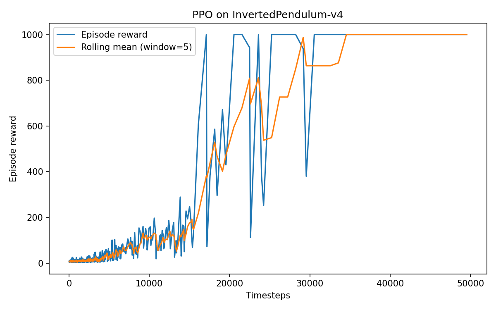
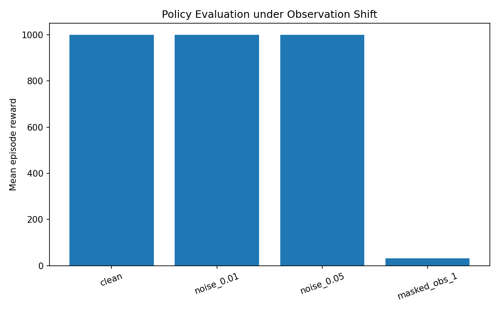
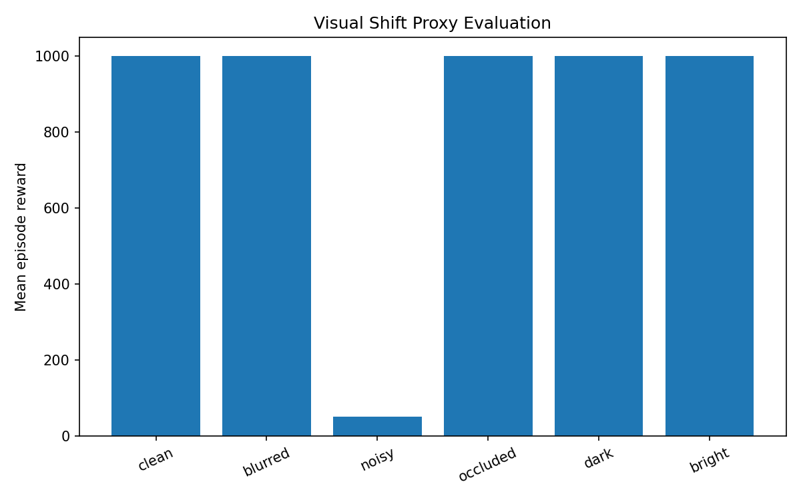

# MuJoCo RL Exploration

Minimal reinforcement learning exploration using MuJoCo and Stable-Baselines3.

## Project Goal

This repository contains a small, reproducible reinforcement learning experiment in a standard MuJoCo continuous-control environment.

The goal is not to propose a new robotics method, but to build practical familiarity with:

- MuJoCo simulation environments
- PPO training with Stable-Baselines3
- closed-loop policy learning
- reward logging and evaluation
- policy robustness under observation perturbations
- understanding how observation quality may influence downstream control behavior

This project supports a broader research interest in perception-to-action systems and robust decision-making under distribution shift.

---

## Environment

The initial experiments use `InvertedPendulum-v4`.

This is a standard MuJoCo continuous-control task where the agent learns to keep a pendulum upright by applying horizontal force to the cart.

The environment provides low-dimensional state observations (not image observations), making it a reliable baseline for studying policy behavior before moving toward more complex visual control settings.

---

## Method

### PPO Training

The policy is trained using PPO (Proximal Policy Optimization).

Implementation details:

- Library: Stable-Baselines3
- Policy: MLP Policy
- Device: CPU
- Training timesteps: 50,000
- Evaluation episodes: 5 deterministic runs

Because the environment provides numerical state observations rather than raw images, an MLP policy is used instead of a CNN-based visual policy.

---

## Observation Shift Evaluation

A second experiment evaluates policy robustness under simple observation perturbations.

Three settings were compared:

- small Gaussian noise added to observations
- stronger Gaussian noise added to observations
- partial observation masking (one state variable removed)

This serves as a minimal proxy for studying how observation quality affects downstream control behavior.

---

## Visual Shift Proxy Evaluation

To study how perception quality may influence downstream control behavior, an additional visual-shift proxy experiment was performed.

This experiment does **not** train a direct image-based policy.

Instead:

1. Clean RGB frames are rendered from the MuJoCo environment
2. Visual degradations are applied:
   - blur
   - Gaussian noise
   - partial occlusion
   - brightness changes
3. Visual degradation severity is measured
4. That severity is mapped to synthetic corruption of the numerical observation vector before policy inference

This provides a lightweight proxy for studying how degraded perception may affect downstream closed-loop control.

The trained PPO policy remains state-based throughout the project.

---

## Results

### Training Reward Curve

The reward curve shows clear learning progression and convergence toward stable control performance.

---

## Deterministic Policy Evaluation

Final evaluation after training:

- Episode 1: Total Reward = 1000.00
- Episode 2: Total Reward = 1000.00
- Episode 3: Total Reward = 1000.00
- Episode 4: Total Reward = 1000.00
- Episode 5: Total Reward = 1000.00

The trained policy consistently reaches maximum reward, indicating stable control of the pendulum.

---

## Observation Shift Results

Policy performance under observation perturbation:

- Clean observations: 1000.00 ± 0.00
- Gaussian noise (0.01): 1000.00 ± 0.00
- Gaussian noise (0.05): 1000.00 ± 0.00
- Partial observation masking: 31.90 ± 5.15

Small Gaussian noise did not significantly affect performance, while removing one critical observation variable caused a strong performance drop.

This suggests that the learned policy is tolerant to small perturbations but highly sensitive to missing state information.

---

## Visual Shift Proxy Results

Policy performance under visual degradation proxy evaluation:

- Clean: 1000.00 ± 0.00
- Blurred: 1000.00 ± 0.00
- Noisy: 50.60 ± 27.81
- Occluded: 1000.00 ± 0.00
- Dark: 1000.00 ± 0.00
- Bright: 1000.00 ± 0.00

Severe visual noise produced a strong performance drop, while blur, occlusion, and brightness changes had limited impact in this proxy setup.

This suggests that sufficiently corrupted observations can significantly affect downstream control stability in this simplified setup.

This provides a minimal proxy for how degraded perception may affect downstream control behavior.

---

## Repository Structure

- `train_ppo.py` — PPO training script
- `evaluate.py` — deterministic policy evaluation
- `evaluate_shift.py` — observation perturbation evaluation
- `evaluate_visual_shift.py` — visual degradation to control-impact proxy evaluation
- `requirements.txt` — Python dependencies
- `models/ppo_inverted_pendulum.zip` — trained PPO model
- `outputs/reward_log.csv` — reward log
- `outputs/reward_curve.png` — training reward plot
- `outputs/shift_evaluation_results.csv` — observation robustness results
- `outputs/shift_evaluation.png` — observation robustness comparison plot
- `outputs/visual_shift_evaluation_results.csv` — visual proxy evaluation results
- `outputs/visual_shift_evaluation.png` — visual proxy evaluation plot

---

## How to Run

Create and activate the environment:

    conda create -n mujoco-rl python=3.11.5 -y
    conda activate mujoco-rl
    pip install -r requirements.txt

Train the PPO agent:

    python train_ppo.py

Evaluate the trained policy:

    python evaluate.py

Run observation shift evaluation:

    python evaluate_shift.py

Run visual shift proxy evaluation:

    python evaluate_visual_shift.py

---

## Future Work

A natural next step is replacing low-dimensional state observations with direct visual observations (rendered RGB frames or camera inputs) and training an image-based policy using a CNN encoder.

This would allow a true perception-to-action pipeline where the policy consumes pixels directly rather than numerical state vectors.

Possible future extensions include:

- CNN-based image policy training
- visual observation reinforcement learning
- camera-based control instead of state-based control
- more complex MuJoCo tasks (HalfCheetah, Hopper, Walker2D)
- sim-to-real transfer analysis
- representation learning for robust embodied decision-making

The current project intentionally starts with a reliable state-based control baseline before moving toward full vision-based control.

---

## Scope and Limitations

This project is intentionally minimal.

It does not claim:

- a novel RL algorithm
- a full vision-based robotics pipeline
- sim-to-real transfer
- real robot deployment
- state-of-the-art robotics performance

It is an initial simulation-based exploration designed to better understand how observation quality influences control behavior in closed-loop systems.