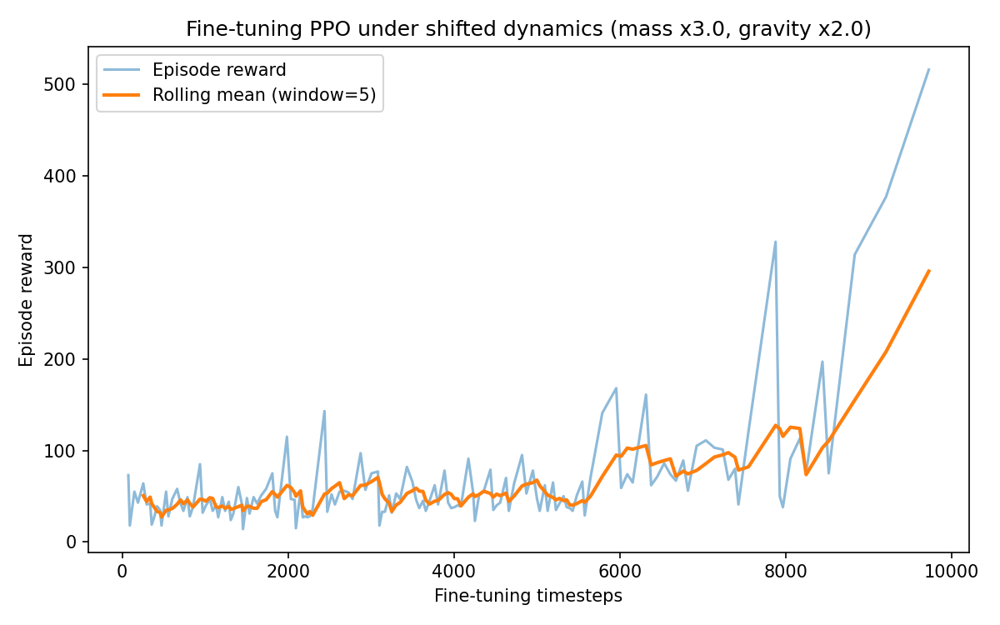
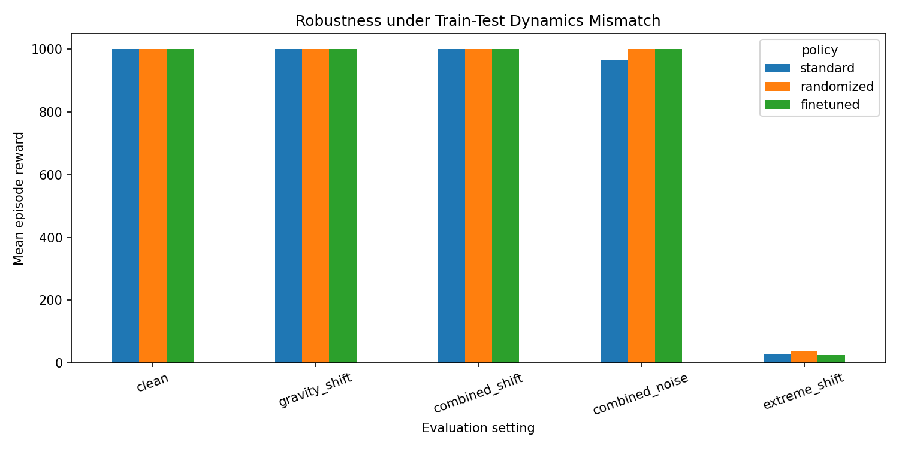
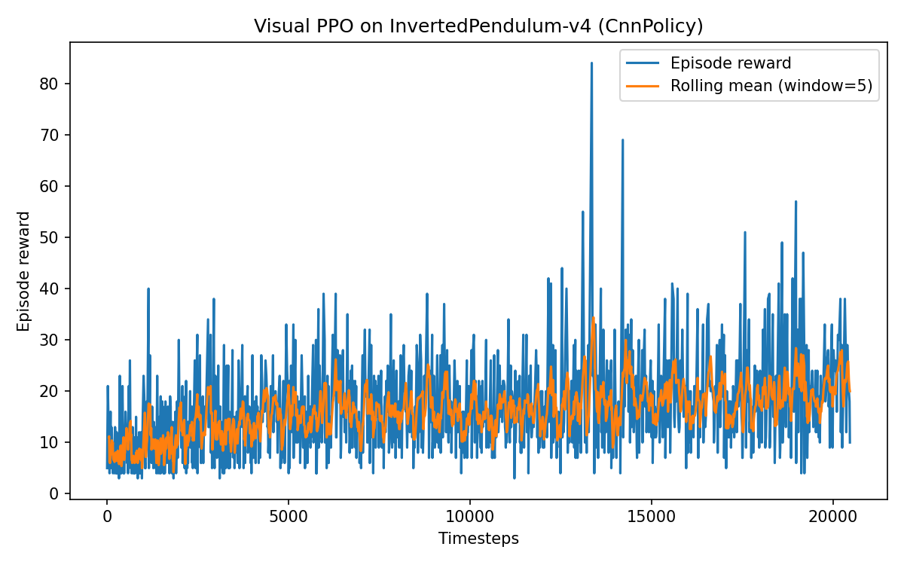

# MuJoCo RL Exploration

A minimal, reproducible reinforcement learning exploration in MuJoCo using Stable-Baselines3.

This repository contains:
- a state-based PPO baseline,
- sensitivity analysis under observation perturbations,
- a dynamics shift evaluation,
- a domain-randomized PPO baseline for train-time dynamics variation,
- a fine-tuning baseline for recovery under shifted dynamics,
- a comparison of standard, domain-randomized, and fine-tuned policies under controlled train-test mismatch,
- an exploratory visual PPO experiment trained directly on rendered RGB frames.

> Limitations and scope are listed explicitly in [`LIMITATIONS.md`](LIMITATIONS.md).

---

## Project Goal

This project aims to build practical familiarity with:

- MuJoCo continuous-control environments
- PPO training with Stable-Baselines3
- closed-loop policy behavior
- sensitivity of learned policies to observation quality
- preliminary train-test mismatch evaluation
- comparison between train-time randomization and post-shift fine-tuning
- basic perception-to-action pipelines from pixels to actions

The goal is not to propose a new method, but to construct a clean, reproducible experimental setup for studying how observation quality, dynamics changes, train-time variability, and post-shift adaptation affect closed-loop control performance.

---

## Environment

Experiments are conducted on `InvertedPendulum-v4`, a standard MuJoCo continuous-control task where the agent learns to keep a pendulum upright.

Two observation modalities are used:

- **State observations** (default low-dimensional vector)
- **Pixel observations** (rendered RGB frames)

---

## Methods

### 1. State-Based PPO Baseline

- Algorithm: PPO (Stable-Baselines3)
- Policy: MLP
- Timesteps: 50,000
- Device: CPU

**Final evaluation:** 1000.00 reward across all 5 episodes.

This confirms the task is solved under clean state observations.

---

### 2. Observation Noise Sensitivity

The trained state-based policy is evaluated under Gaussian noise added to observations at inference time.

| Noise sigma | Mean Reward | Std    |
|-------------|-------------|--------|
| 0.00        | 1000.00     | 0.00   |
| 0.05        | 1000.00     | 0.00   |
| 0.10        | 81.90       | 81.33  |
| 0.20        | 13.90       | 5.87   |
| 0.30        | 8.90        | 5.05   |

**Observation:** Performance collapses beyond a small noise threshold (around 0.05-0.10), indicating strong sensitivity to observation quality. This is a single empirical observation, not a general robustness claim.

---

### 3. Observation Perturbation Experiments

Additional evaluation of the state-based policy under:

- Gaussian noise
- Partial observation masking

Small perturbations have minimal effect; missing state information causes strong degradation.

---

### 4. Visual Degradation Proxy

A lightweight experiment that:

1. renders RGB frames from the environment,
2. applies visual degradations (blur, noise, occlusion, brightness),
3. measures degradation severity,
4. maps that severity to noise on the **state vector** before policy inference.

**Note:** this script evaluates the **state-based** policy. It does not train or evaluate an image-based policy.

---

### 5. Dynamics Shift Evaluation

The trained state-based policy is evaluated under combined dynamics and observation perturbations:

- **Mass scaling:** the body mass of the cart and pole is multiplied by a factor
- **Gravity scaling:** the gravity vector is multiplied by a factor
- **Observation noise:** Gaussian noise added to the state vector

**Results:**

| Setting              | Mass | Gravity | Noise | Mean Reward | Std    |
|----------------------|------|---------|-------|-------------|--------|
| clean                | 1.00 | 1.00    | 0.00  | 1000.00     | 0.00   |
| mass_low             | 0.75 | 1.00    | 0.00  | 1000.00     | 0.00   |
| mass_high            | 2.00 | 1.00    | 0.00  | 1000.00     | 0.00   |
| gravity_high         | 1.00 | 1.50    | 0.00  | 1000.00     | 0.00   |
| mass_gravity_high    | 2.00 | 1.50    | 0.00  | 1000.00     | 0.00   |
| mass_gravity_noise   | 2.00 | 1.50    | 0.05  | 965.40      | 103.80 |
| extreme_shift        | 3.00 | 2.00    | 0.10  | 24.50       | 13.41  |

**Observation:** The policy is highly tolerant to dynamics-only changes (mass and gravity) within a reasonable range. Only the combination of heavy dynamics shifts and observation noise causes performance to collapse.

**Note:** This is a preliminary train-test mismatch evaluation, not a formal distribution-shift benchmark.

---

### 6. Fine-Tuning Baseline (Recovery Under Shift)

A simple fine-tuning experiment is included as a basic recovery baseline. The pretrained PPO policy is further trained for 10,000 timesteps under heavily shifted dynamics (mass x3.0, gravity x2.0), the setting where the pretrained policy fails.

**Results:**

| Stage              | Mean Reward | Std  |
|--------------------|-------------|------|
| Before fine-tuning | 102.30      | 7.84 |
| After fine-tuning  | 1000.00     | 0.00 |
| **Change**         | **+897.70** |      |

**Observation:** Fine-tuning the pretrained policy on the shifted environment recovers full performance (reward 1000) within 10K timesteps. The reward curve shows clear learning progression.

**Note:** This is a **simple fine-tuning baseline**, not meta-learning, online adaptation, or any sophisticated continual learning mechanism. See `LIMITATIONS.md`.

---
### 7. Robustness under Train-Test Dynamics Mismatch

As a lightweight extension, a domain-randomized PPO baseline was added where mass and gravity are randomized during training.

A central question explored in this extension is whether robustness should emerge from training-time variability (domain randomization) or from lightweight post-shift adaptation after deployment mismatch occurs.

Three policies are compared:

- standard PPO trained on default dynamics,
- domain-randomized PPO trained under varying mass/gravity settings,
- fine-tuned PPO adapted after severe dynamics mismatch.

The goal is not to claim sim-to-real robustness, but to study how simple robustness mechanisms affect closed-loop policy behavior under controlled train-test mismatch.

**Results:**

| Setting        | Standard PPO | Domain-Randomized PPO | Fine-Tuned PPO |
|----------------|--------------|------------------------|----------------|
| clean          | 1000.00      | 1000.00                | 1000.00        |
| gravity_shift  | 1000.00      | 1000.00                | 1000.00        |
| combined_shift | 1000.00      | 1000.00                | 1000.00        |
| combined_noise | 965.40       | 1000.00                | 1000.00        |
| extreme_shift  | 27.10        | 37.00                  | 25.70          |

**Observation:** Moderate train-time randomization improved tolerance under combined dynamics and observation mismatch in this setting, but severe deployment mismatch still caused failure across all policies. This suggests that simple dynamics randomization alone is insufficient under extreme observation corruption.

**Note on the fine-tuned policy:** The fine-tuned PPO policy was adapted under severe dynamics shift only (mass x3.0, gravity x2.0, noise 0.0), where it recovered full performance. In the cross-shift comparison, `extreme_shift` additionally includes observation noise (`noise=0.10`). Therefore, the lower fine-tuned performance in this row reflects failure under combined dynamics and observation corruption, not a contradiction with the fine-tuning recovery result.

**Note:** This is a lightweight comparison of robustness mechanisms in a controlled MuJoCo setting. It should not be interpreted as formal sim-to-real transfer or a general robustness benchmark.

### 8. Exploratory Visual PPO (Pixel-Based Policy)

A PPO agent is trained directly on RGB frames:

- Policy: CnnPolicy
- Input: 64x64 RGB images
- Timesteps: 20,000 (exploratory short run)
- Device: CPU

**Interpretation:**

- reward increases from ~5 to ~20-25 (rolling mean), peaks ~85
- indicates partial learning from pixels
- **not fully converged** - a converged visual policy on this task typically requires 500K-1M+ timesteps

This experiment demonstrates the end-to-end pipeline:

RGB observations -> CNN policy -> action

---

### 9. Visual Encoder Demonstration

`perception_pipeline.py` demonstrates:

- RGB rendering
- CNN feature extraction
- closed-loop execution with the state-based policy

The CNN encoder is not integrated into the policy network in this script. It serves as a standalone demonstration of visual processing infrastructure.

---

## Repository Structure

**Scripts:**
- `train_ppo.py` - state-based PPO training
- `train_domain_randomized_ppo.py` - PPO training with lightweight mass/gravity randomization
- `train_visual_ppo.py` - exploratory visual PPO (CnnPolicy)
- `pixel_wrapper.py` - RGB observation wrapper
- `wrappers.py` - Gaussian observation noise wrapper
- `evaluate.py` - deterministic evaluation
- `evaluate_observation_noise.py` - sensitivity analysis under noise
- `evaluate_shift.py` - observation perturbation evaluation
- `evaluate_visual_shift.py` - visual degradation proxy (state-based)
- `evaluate_dynamics_shift.py` - dynamics and observation shift evaluation
- `evaluate_domain_randomized.py` - comparison of standard, domain-randomized, and fine-tuned policies
- `finetune_shift.py` - fine-tuning baseline under shifted dynamics
- `perception_pipeline.py` - CNN encoder demonstration

**Models:**
- `models/ppo_inverted_pendulum.zip` - state-based PPO
- `models/ppo_domain_randomized.zip` - PPO trained with lightweight mass/gravity randomization
- `models/ppo_visual_inverted_pendulum.zip` - exploratory visual PPO
- `models/ppo_finetuned_shift.zip` - fine-tuned PPO under shifted dynamics

**Outputs:**
- `outputs/reward_curve.png` - state-based training curve
- `outputs/domain_randomized_reward_curve.png` - domain-randomized PPO training curve
- `outputs/domain_randomization_results.csv` - policy comparison results under train-test mismatch
- `outputs/domain_randomization_comparison.png` - robustness comparison across policy variants
- `outputs/visual_reward_curve.png` - visual PPO training curve
- `outputs/finetune_reward_curve.png` - fine-tuning reward curve
- `outputs/*.csv` - reward logs and evaluation results
- `outputs/*.png` - additional evaluation plots

---

## How to Run

Setup the environment:

    conda create -n mujoco-rl python=3.11.5 -y
    conda activate mujoco-rl
    pip install -r requirements.txt

Train baselines:

    python train_ppo.py
    python train_domain_randomized_ppo.py
    python train_visual_ppo.py

Evaluate:

    python evaluate.py
    python evaluate_observation_noise.py
    python evaluate_shift.py
    python evaluate_visual_shift.py
    python evaluate_dynamics_shift.py
    python evaluate_domain_randomized.py
    python perception_pipeline.py

Fine-tune under shifted dynamics:

    python finetune_shift.py

---

## Scope

This is an exploratory project.

**It does not claim:**
- a novel RL algorithm
- fully converged visual control
- formal distribution-shift analysis
- meta-learning, online adaptation, or continual learning
- sim-to-real transfer
- real robot deployment
- advanced robotics deployment expertise

**It provides:**
- a reproducible state-based PPO baseline
- empirical sensitivity analysis under observation noise
- a preliminary train-test mismatch evaluation (mass and gravity scaling)
- a lightweight domain-randomized PPO baseline
- a comparison between standard PPO, train-time dynamics randomization, and post-shift fine-tuning
- a simple fine-tuning baseline that recovers performance under shifted dynamics
- a working but unconverged pixel-to-action training pipeline
- a standalone CNN encoder demonstration
- explicit limitations (see [`LIMITATIONS.md`](LIMITATIONS.md))

---

## Future Work

- longer visual PPO training (>=500K timesteps)
- integration of the CNN encoder directly into the policy network
- rigorous comparison of state vs. pixel robustness
- more rigorous domain randomization protocols and sim-to-real-inspired evaluation
- multi-seed evaluation and statistical analysis
- meta-learning or online adaptation mechanisms
- scaling to more complex MuJoCo tasks (HalfCheetah, Hopper, Walker2D)